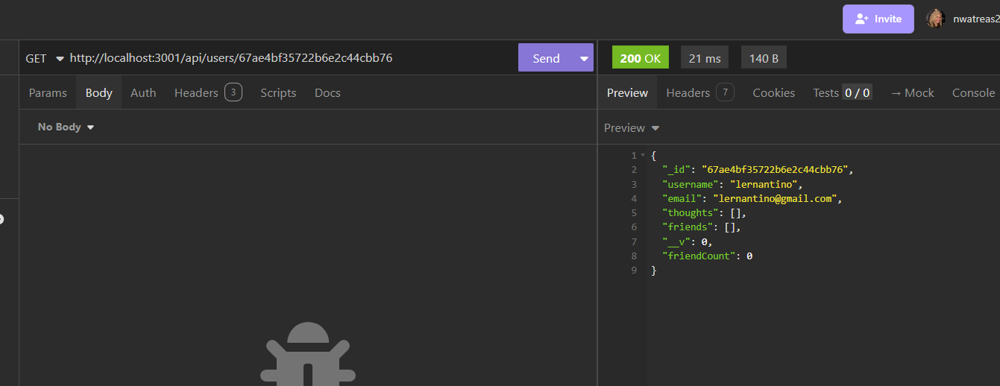

# Social Network API - NoSQL

## Website: 
[website](https://github.com/noIDEA-tech/17--NoSQL-Social-Network-API)

## Description
This project is an API created for a social network web application for users to create a friend list, share their thoughts and react to friends' thoughts. It is built using Express.js for routing, a MongoDB database and Mongoose ODM and can be tested in Insomnia.

## Table of Contents
- [Installation](#installation)
- [Usage](#usage)
- [Credits](#credits)
- [License](#license)
- [Features](#features)
- [Tests](#tests)
- [Contact](#contact)

## Installation
npm i, npm run build

## Usage
Run npm run start and test in Insomnia 

## Credits
Nancy Watreas

## License
MIT

## Features
Testing CRUD operations

## Tests
POST, GET, PUT, DELETE ON USERS, THOUGHTS, FRIENDS, AND REACTIONS

## Contact
If there are any questions or concerns, I can be reached at:
##### [github: noIDEA-tech](https://github.com/noIDEA-tech)
##### [email: nwatreas2023@gmail.com](mailto:nwatreas2023@gmail.com)
